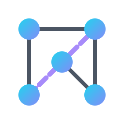

<div align="center">
  
  <h1>
    <b>DSA Graph Visualizer</b>
  </h1>
  <p>
    An advanced, interactive web application for visualizing and learning complex graph algorithms,
    <br />
    built with a modern tech stack for a seamless and educational experience.
  </p>
  <p>
    <strong><a href="https://dsa-graph-visualiser.onrender.com">Live Demo »</a></strong>
  </p>
</div>

<div align="center">
  
  
  
  
</div>

<br />

---

## ✨ Features

The DSA Graph Visualizer is more than just a tool; it's a comprehensive learning platform.

-   **Interactive Canvas:**
    -   **Intuitive Controls:** Drag & drop nodes to organize the layout.
    -   **Smart Edge Creation:** Hold `Shift` + `Click-and-Drag` between nodes to create edges instantly.
    -   **Resizable Workspace:** Dynamically resize the canvas with a drag handle for larger, more complex graphs.
    -   **Context Menu:** Right-click for quick actions like editing, deleting, or adding elements.

-   **Rich Algorithm Suite (10 Visualizations):**
    -   **Traversal:** BFS, DFS
    -   **Shortest Path:** Dijkstra's, A*, Bellman-Ford (with negative weight handling), Floyd Warshall
    -   **Minimum Spanning Tree:** Prim's, Kruskal's
    -   **Analysis & Ordering:** Topological Sort, Cycle Detection, and Connectivity Analysis (including SCCs).

-   **Deep Educational Insights:**
    -   **Live Data Structures:** Watch the **Adjacency List** and **Adjacency Matrix** update in real-time as you modify the graph.
    -   **Dynamic Animations:** All algorithms are visualized step-by-step with a "pulsing" node effect to highlight the current operation.
    -   **On-Hover Data:** Instantly view a node's **Degree** (or In/Out-Degree for directed graphs) by hovering.

-   **Professional UI/UX:**
    -   **Dual Themes:** A sleek Dark Mode and a clean Light Mode.
    -   **Graph Constructor:** Build complex graphs instantly from an interactive Adjacency Matrix.
    -   **Persistence:** Your work is automatically saved to local storage, and you can manage multiple saved graphs.
    -   **Guided Tour:** A comprehensive, interactive tutorial for new users.

---

## 🚀 About The Project

This project was born from a passion for data structures and a desire to demystify complex algorithms. Traditional learning methods often rely on static diagrams and pseudo-code, which can make it difficult to grasp the dynamic nature of graph traversals and analyses.

The DSA Graph Visualizer aims to solve this by providing a hands-on, interactive environment. By allowing users to build their own graphs and see algorithms execute in real-time, it bridges the gap between abstract theory and practical understanding.

---

## 🛠️ Built With

This project leverages a modern and efficient tech stack to deliver a smooth and responsive user experience:

| Technology                                                 | Description                                            |
| ---------------------------------------------------------- | ------------------------------------------------------ |
| **[React.js](https://reactjs.org/)**                       | For building a component-based, declarative UI.        |
| **[Vite](https://vitejs.dev/)**                            | Next-generation frontend tooling for blazing-fast HMR.   |
| **[Tailwind CSS](https://tailwindcss.com/)**               | A utility-first CSS framework for rapid styling.       |
| **[Framer Motion](https://www.framer.com/motion/)**        | For creating fluid, high-performance animations.       |
| **HTML5 Canvas**                                           | For high-performance rendering of the graph elements.  |

---

## 🏁 Getting Started

To get a local copy up and running, follow these simple steps.

### Prerequisites

Ensure you have Node.js (v18 or later) and npm installed on your machine.

### Installation

1.  **Clone the Repository**
    ```sh
    git clone https://github.com/Saumy-TOXOTIS/dsa-graph-visualiser.git
    ```
2.  **Navigate to the Project Directory**
    ```sh
    cd dsa-graph-visualiser
    ```
3.  **Install Dependencies**
    ```sh
    npm install --legacy-peer-deps
    ```
4.  **Run the Development Server**
    ```sh
    npm run dev
    ```

The application will now be running on a local port (usually `http://localhost:5173`).

---

## 👤 Author

**Saumy Tiwari (TOXOTIS)**

*   **GitHub:** [Saumy-TOXOTIS](https://github.com/Saumy-TOXOTIS)

<br />

<div align="center">
  <p>
    Made with ❤️ and a lot of algorithms.
  </p>
</div>
